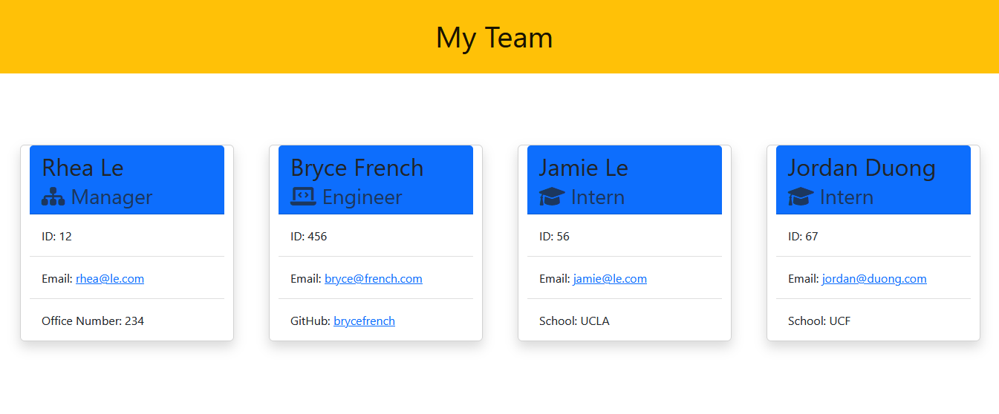

# Team-Profile-Generator

[](https://opensource.org/licenses/MIT)

## Table of Contents

- [Summary](#Summary)
- [User Story](#user-story)
- [Installations](#Installations)
- [Tests](#Tests)
- [Mock-up](#Mock-up)

## Summary

Node js and Inquirer were used to create a command prompt that asks questions about their team and generate a page containing employee information. When the user starts the command line, they will be prompted to add a manager for the team. After they complete the prompt for the manager, they will asked to added another team member (engineer, intern). Once the user finishes adding all the team members, the application will generate an html file with simple employee information on the page. The user will be able to open the github profiles on a separate page or click on the email address and the default email program will open up.

## User Story

```md
AS A manager
I WANT to generate a webpage that displays my team's basic info
SO THAT I have quick access to their emails and GitHub profiles
```

## Installations

- ✅ Node js: required to run application
- ✅ Inquirer: to create prompts
- ✅ Jest: testing

## Tests

Jest was used to test this application.

## Mock-up




---

MIT License

Copyright (c) 2022 Rhea Le

Permission is hereby granted, free of charge, to any person obtaining a copy
of this software and associated documentation files (the "Software"), to deal
in the Software without restriction, including without limitation the rights
to use, copy, modify, merge, publish, distribute, sublicense, and/or sell
copies of the Software, and to permit persons to whom the Software is
furnished to do so, subject to the following conditions:

The above copyright notice and this permission notice shall be included in all
copies or substantial portions of the Software.

THE SOFTWARE IS PROVIDED "AS IS", WITHOUT WARRANTY OF ANY KIND, EXPRESS OR
IMPLIED, INCLUDING BUT NOT LIMITED TO THE WARRANTIES OF MERCHANTABILITY,
FITNESS FOR A PARTICULAR PURPOSE AND NONINFRINGEMENT. IN NO EVENT SHALL THE
AUTHORS OR COPYRIGHT HOLDERS BE LIABLE FOR ANY CLAIM, DAMAGES OR OTHER
LIABILITY, WHETHER IN AN ACTION OF CONTRACT, TORT OR OTHERWISE, ARISING FROM,
OUT OF OR IN CONNECTION WITH THE SOFTWARE OR THE USE OR OTHER DEALINGS IN THE
SOFTWARE.
